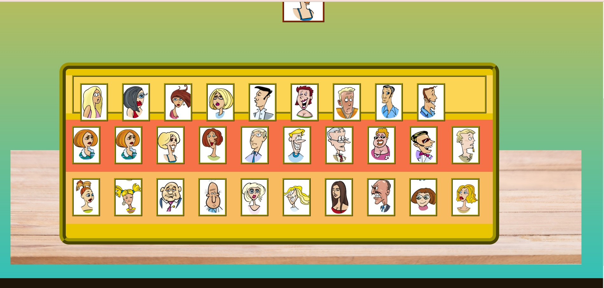

# GUESS WHO GAME
---

Guess who is a game I've often played with my kids.
It usually requires two players, but in this case the player
is playing solo. From the outset I had a plan to make it a game
against the computer, but it turned out to be very complicated.

So the idea is that the player is going to ask questions about a hidden card
that is turned upside down over the board game. This hidden person is also 
a person on the players own game board. After each question about features
of the hidden person card, the players card with these choosen features get turned,
narrowing down the possible suspects.

For instance the player can ask, with radiobuttons, if the person is a 'man' - the hidden
person is a 'man' so all the woman on the player board get turned. Left is a smaller
pile of cards, the player can at anytime guess by hitting the guess button and point on 
one of the cards showing people. The player has one guess, then its game over.

---
## Game Functionality 

Unfortunatly I did´nt get the game to function properly in time for submission.
The amount to learn about manipulating arrays and different methods and new functions to display
images etc across the DOM took alot of time. I almost pulled it together and with a couple of days
I could make it run as planned.

---

## Features
---

### Questions

The player is able to choose from a range of categories that corresponds to the features of the persons on the card.
For instance the player can ask about values of age, sex, haircolor, hairtype, mood, glasses, beard - Is the hidden person
blond will promt you asked if the hidden person is 'blond' - the answer is 'no'.

### Guessing
The player can press the quess button and click on any showing a person card he/she. Either its the correct choice and the player wins
or if not the game is over.

### Persons traits
Its quite fun to try and figure out who among the persons look 'old', is 'bald', have 'beard' (only one actually has).

## Shuffle play Cards
I tried making the visible cards shuffle after each new game to make it more interesting and disorienting. Unfortunatly this function
dont work properly yet. 

Design
---
Playing Cards where found on dreamstime where I have an account and cropped them into equal size using Adobe Illustrator express.
The table that the gameboard is standing on was also found on dreamstime. i tried making the layout look fun with comical
persons on the cards. 

## Future Implementations
---
In a future update of the game a light AI opponent could be integrated with buttons for the player to answer yes or no, 
taking turns to answer and question.

## Accessibility
---
I tried to make the cards big enough and choose cards with clear details to be able to easly discern the features.
The playing cards don´t have alt text but img names are named according to features of the persones and could easily be 
complemented with alt text also.

---

# Debugging, showHiddenCard() and innerHTML
The Html and CSS code in general is fully functional without errors. I have used Visual studio error code messages as guide to javascript code.
The errors showing up are from images that are passed with innerHTML between script.js and index.html using the function showHiddenCard(). 
Somehow the array I created of images for this function dont show up in the browser. This function should shuffle a random card from 
the 30 persons avaiable at each press on the new game button. 
The hidden card is changing value to different persons in the console for each new game button push, but dont show up in browser.

### Changing img file name
My last attempt to debugg the game was to change all the img file names in the image folder from file names with space between into filenames with
underscore. I suspected this was the reason why images did not show up in the hidden card slot.

## Testing
I have tried functions and code snippets in javatutor and various other code testers.
I have for each step or new function used google dev tools and console.logs to see if the code passed and tried to find
the reason and fix them. I also in the end tried using the vs code editors debugging function to see the bug better but could not make it work.
No performed W3c Validator test or lighthouse testing yet since I dont have a fully functional game yet.

## The filter.people function

I have in code comments left reference to functions I have learned from youtube and other sources. My mentor Brian O'hare, who I 
have had regular meetings with advised and showed me the filter.array function that I could use. Making arrays was the key to this 
project and from the outset it didn´t look very complicated. This function was so crucial to get the work moving forward. 
The filter people function was the key that should filter my people array to trigger different actions with the cards. 
The filter.people function is marked in comments in script.js.

# To be continued
As this game is not fully functional yet I dont expect to get a pass, so I continue and will present the end result very soon.

---
