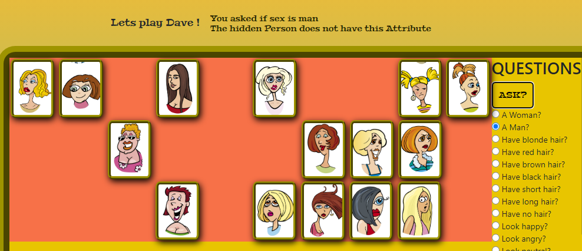
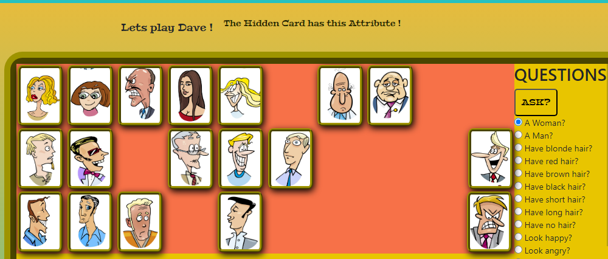

# GUESS WHO GAME 
---

Guess who is a game I've often played with my kids.
It usually requires two players, but in this case the player
is playing solo. From the outset I had a plan to make it a game
against the computer taking turns to guess as in a real guess who game.
But for the scope of this project a solo game is sufficient.

So the idea is that the player is going to ask questions about a hidden card
that is turned upside down over the board game. This hidden person is also 
a person on the players own game board. After each question about features
of the hidden card, the board cards that have these features is removed,
narrowing down the possible candidates. But they can be turned up again
if the player asks a correct attribute of the hidden card. So it becomes a 
guess who game with a twist so that cards that the player have ruled out can suddenly
be turned up again and the player has to remember what questions where asked before.
So instead of narrowing down the cards with less to choose from the player has to keep
track of the the features of the hidden card. 

For instance the player can ask, with radiobuttons, if the person is a 'man' - the hidden
person is a 'man' so all the woman on the player board is removed and the player is informed 
about the current question and that the hidden card does not have this attribute. If the hidden card
has this attribute the player is informed that it does.

Each time the player guess an attribute the hidden card does not have
the pile of board cards get smaller and smaller, the player can at anytime 
guess by hitting the guess button and point on one of the cards showing people.
The player has one guess, then its game over.

---
## Game Functionality 

---

## Features
---

### Questions

The player is able to choose from a range of categories that corresponds to the features of the persons on the card.
For instance the player can ask about values of age, sex, haircolor, hairtype, mood, glasses, beard - Is the hidden person
blond will promt you asked if the hidden person is 'blond' - the answer is 'no'.

### Guessing
The player can press the quess button and click on any showing a person card he/she. Either its the correct choice and the player wins
or if not the game is over.

### Persons traits
Its quite fun to try and figure out who among the persons look 'old', is 'bald', have 'beard' (only one actually has).

## Shuffle play Cards
I tried making the visible cards shuffle after each new game to make it more interesting and disorienting. Unfortunatly this function
dont work properly yet. 

Design
---
Playing Cards where found on dreamstime where I have an account and cropped them into equal size using Adobe Illustrator express.
The table that the gameboard is standing on was also found on dreamstime. i tried making the layout look fun with comical
persons on the cards. 

## Future Implementations
---
In a future update of the game a light AI opponent could be integrated with buttons for the player to answer yes or no, 
taking turns to answer and question.

## Accessibility
---
I tried to make the cards big enough and choose cards with clear details to be able to easly discern the features.
The playing cards don´t have alt text but img names are named according to features of the persones and could easily be 
complemented with alt text also.

---

# Debugging

###
For a long time I could not get the cards to dissapear when asking a question about the hidden card with the radio buttons.
I used classlist in stripImg() on the selected cards to make them dissapear from the board.
The cards would flash for a moment then return to original state again.

The sources for this issues was:

#### Source 1:
- Bootstrap button override with CSS
- solution: copy into 'fade' classlist css
#### Source 2:
- tag: form was used around the radio buttons
solution: Remove form tags
#### Source 3:
- button has type="submit"
- solution: remove type="submit"

### Deploying the website to GitHub Pages:
The site was deployed to GitHub pages. The steps to deploy are as follows:
- In the GitHub repository, navigate to the Settings tab
- From the source section drop-down menu, select the Master Branch
- Once the master branch has been selected, the page will be automatically refreshed with a detailed ribbon display to indicate the successful deployment.

The live link can be found here -

## Testing

When running the code in validator.w3.org I received warnings that certain headings was empty.
These headings are used to inject messages using innerHTML from Javascript and they should
not contain any text from the start.

After adding some dots for each heading no errors where found in the HTML.

I also did a Jigsaw test and received only errors from the bootstrap css.

Following up to test with Lighthouse gave these results

## The filterPeople function

I have in code comments left reference to functions I have learned from youtube and other sources. My mentor Brian O'hare, who I 
have had regular meetings with advised and showed me the filter.array function that I could use. Making arrays was the key to this 
project and from the outset it didn´t look very complicated. This function was so crucial to get the work moving forward. 
The filter people function was the key that should filter my people array to trigger different actions with the cards. 
The filter.people function is marked in comments in script.js.

### Media
- The images in the website including gallery and background are taken from [dreamstime.com](https://www.dreamstime.com/)

  ### Thank You
- to my mentor @Brian O,hare for supporting me with his feedback through the entire project
- to Tutor support of Code Institute
- to Code Institute and Slack community for helping me when I was getting stuck with some challenges.

---
