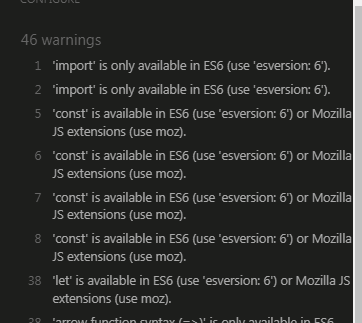

# GUESS WHO GAME 

---


[Live Site](https://thomasspare.github.io/GuessWho/)

# About
---
Guess who is a game I've often played with my kids.
It usually requires two players, but in this case the player
is playing solo. From the outset I had a plan to make it a game
against the computer taking turns to guess as in a real guess who game.
But for the scope of this project a solo game was sufficient.

The workings of this game is that the player will have to ask questions of the
attributes of
the hidden card that is turned upside down and in the end make a correct guess
about the hidden card to win.
The hidden person is also a person on the players own game board.
After each question about attributes
of the hidden card, the board cards that have these features is removed,
narrowing down the possible candidates. But they can be turned up again
if the player asks a correct attribute of the hidden card. So it becomes a guess who game with a twist so that cards that the player has ruled out can suddenly be turned up again and the player has to remember what questions where asked before. So instead of narrowing down the cards with smaller pile to choose from the player has to keep track of the the attributes of the hidden card.

For instance the player can ask, with radiobuttons, if the person is a 'woman' - the hidden person is a 'man' so all the woman on the player board is removed and the player is informed about the current question and that the hidden person does not have this attribute. If the hidden card has this attribute the player is informed that it does.

 <details><summary>Screenshots questions</summary>
  

</details>
Each time the player guess an attribute that the hidden card does not have
the pile of board cards get smaller and smaller, the player can at anytime
guess by clicking on one of the cards and then hit the guess button.
The player has one guess. If its a correct guess the player wins
, if not the game over.

---

## Game Functionality
### Hidden Card
The hidden card is selected by random for each new game. It is only revealed when the player has made a guess. The hidden card is also a card that is displayed on the players game board.

### Questions

The player is able to choose from a range of categories that corresponds to the attributes of the persons on the cards.
For instance the player can ask about values of age, sex, haircolor, hairtype, mood, glasses, beard - If the player ask if the hidden person is blond and the hidden person is blond, the player will be informed that the hidden card has this attribute. If the hidden person is not blond the player will be informed that the hidden person does not have 'haircolor' 'blond' and all boardcards with this attribute are removed. 

### Guessing

The player can at anytime click on a boardcard and then click the quess button to make a guess about the hidden card. Either its the correct choice and the player wins
or if not the game is over. The hidden person is revealed when making a guess.
 <details><summary>Screenshot Player Win</summary>
  
</details>

### Persons traits

Its quite fun to try and figure out who among the persons look 'old', is 'bald', have 'beard' (only one actually has). I tried to tweak the attributes to match the persons on the card as much as possible but sometimes what actually constitutes long hair is not always evident.

### Moves Counter
After each question the count in incremented and when the player wins a message on how many moves
were needed to quess the hidden card is displayed. 

### Play again
If the player want to reset the game and start over the play again button can be clicked.

## Design

- Playing Cards where found on dreamstime where I have an account and cropped them into equal size using Adobe Illustrator express.
- The table that the gameboard is standing on was also found on dreamstime. 
- I tried to make the layout of the game look fun with comical characters on the cards and suitable cartoon fonts.
 <details><summary>Screenshot Peralta Fonts</summary>
  
</details>

- The fonts used are from google fonts and are called 'Peralta'

- Background color is from uigradients.com. 

## Future Improvements
---
The filenames of the card images are named with only numbers in their filename in order to simplify the process of runnning them multiple times through functions and filterfunctions. This is not best practice and could cause future problems in various situations.

Most of the time the hiddencard are visible on the players game board, but I have found that it temporarily have been removed. It is almost always card 1.jpg. Some future debugging of this might be done.


## Accessibility
---

I tried to make the cards big enough and choose cards with clear details to be able to easly discern the features. When playing on smaller screens the text also displays larger to imporve accessibilty. The player can also select a radio button by just touching the label of the button. 


# Debugging

###

For a long time I could not get the cards to be removed when asking a question about the hidden card with the radio buttons. The cards would flash for a moment then return to their original state again.
I got a tip from tutor support to use classlist in stripImg() on the selected cards to apply the class 'slot' and 'fade' to make them be faded and that way be removed. I found that using classlist in this way was very useful. 

## Source of this error
The sources for this issues was:

#### Source 1:

- Bootstrap button override with CSS
- solution: copy into 'fade' classlist css

#### Source 2:

- tag: form was used around the radio buttons
  solution: Remove form tags

#### Source 3:

- button has type="submit"
- solution: remove type="submit"

### Unfixed Bugs
- No unfixed bugs.

# Deploying the website to GitHub Pages:
###
The site was deployed to GitHub pages. The steps to deploy are as follows:
- In the GitHub repository, navigate to the Settings tab
- Navigate to Pages menu to the right
- Select the projects Main branch from the drop-down menu under Branch
- Once the master branch has been selected, the page will be automatically refreshed with a detailed ribbon display to indicate the successful deployment.

The live link can be found here - [Live Site](https://thomasspare.github.io/GuessWho/)

### Cloning the repository
1. Visit the GitHub page of the website’s repository
2. Click the “Clone” button on top of the page
3. Click on “HTTPS”
4. Click on the copy button next to the link to copy it
5. Open your IDE
6. Type ```git clone <copied URL>``` into the terminal


# Testing
###


 <details><summary>Screenshot HTML Validator</summary>
  
</details>When running the code in validator.w3.org I received warnings that certain headings was empty.
These headings are used to inject messages using innerHTML from Javascript and they should
not contain any text from the start.

 <details><summary>Screenshot HTML Validator Corrected</summary>
  
</details>
After adding dots for each heading no errors where found in the HTML.

 <details><summary>Screenshot Jigsaw</summary>
  
</details>
I also did a Jigsaw test and received errors from the bootstrap css.


 <details><summary>Screenshot JSHint</summary>
  
</details>
I also tested script.js code with JSHint and received no unused varibles or
errors, only warnings relating to using ES6.
<br>


<br>
Following up to test with Lighthouse gave these results

## The filterPeople function

My mentor Brian O'hare, who I
have had regular meetings with advised and showed me the filter.array function that I could use. Making arrays was the key to this
project and from the outset it didn´t look very complicated. This function was so crucial to get the work moving forward.
The filter people function was the key that should filter my people array to trigger different actions with the cards.
The filter.people function is marked in comments in script.js.

### Media

- The images in the website including gallery and background are taken from [dreamstime.com](https://www.dreamstime.com/)

  # Thanks
  ###

- to my mentor @Brian O,hare for supporting me with feedback through the entire project
- to Tutor support of Code Institute
- to Code Institute and Slack community for helping me when I was getting stuck with some challenges.

---
